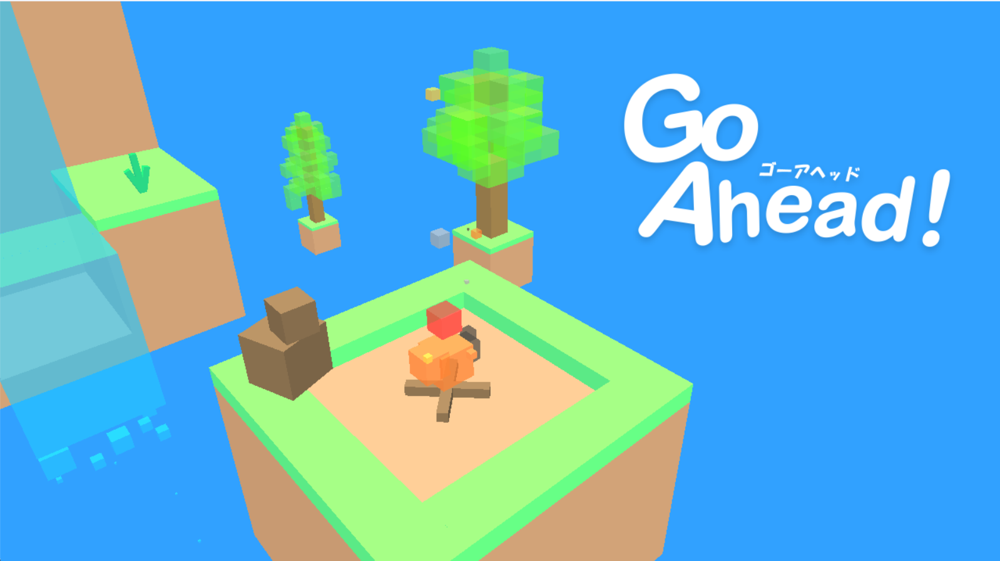

<picture>
  <source media="(prefers-color-scheme: dark)" srcset="https://raw.githubusercontent.com/obregonia1/obregonia1/master/img/snake-dark.svg">
  <source media="(prefers-color-scheme: light)" srcset="https://raw.githubusercontent.com/obregonia1/obregonia1/master/img/snake.svg">
  
</picture>

<!--バッジ-->

  <!--プロフィールへのアクセス数-->
  

# 😀Hello!
Thank you for viewing.

# 🏫 About Hokkaido Cyber Creators Professional Training College
🔗[Official Website](https://yoshida-hcc.jp/) 
🔗[Instagram](https://www.instagram.com/yoshidajobi/) 
🔗[Youtube](https://www.youtube.com/@jobigame)

# 🎮 My Works
<!-- VERSUS -->

  

 VERSUS ( 23/10/2024 ~ 31/01/2025 ) 

- 📁versus  
  - 📁appeal_sheet
    - 📄appeal_sheet.pdf  
  - 📁executable_file
    - 📁assets
    - 📄versus.exe  
  - 📁pv
    - 📄pv.mp4
    - 📄thumbnail.png  
  - 📁screenshot
    - 📄screenshot000.png
    - 📄screenshot001.png
    - 📄screenshot002.png  
  - 📄readme.txt
 

> [!CAUTION]
> VERSUS requires functional levels 12_0 and 12_1.

<!-- Go Ahead! -->

  

 Go Ahead! ( late 07/2024 ~ 29/09/2024 ) 

- 📁go_ahead  
  - 📁appeal_sheet
    - 📄appeal_sheet.pdf  
  - 📁executable_file
    - 📁res
    - 📄go_ahead.exe  
  - 📁pv
    - 📄pv.mp4  
  - 📁screenshot
    - 📄000_title.png
    - 📄001_spring.png
    - 📄002_summer.png
    - 📄003_autumn.png
    - 📄004_winter.png
    - 📄005_result.png
    - 📄006_snowman.png  
  - 📄readme.txt
 

